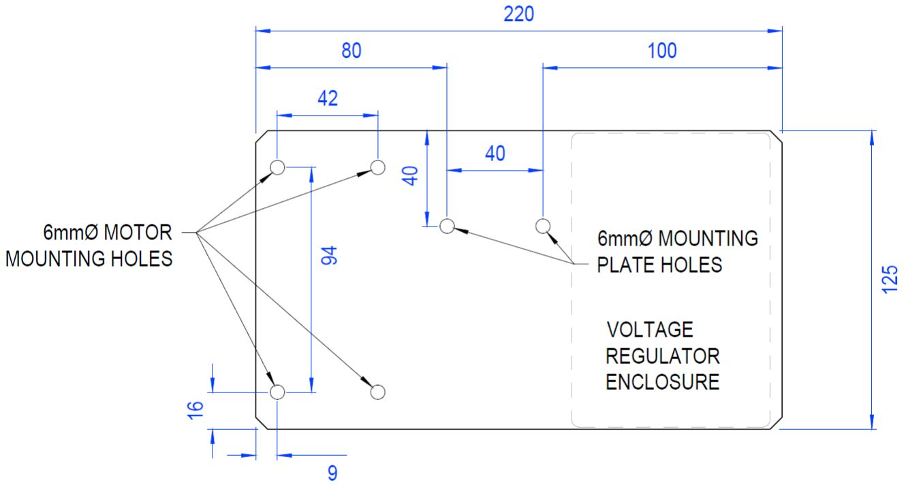
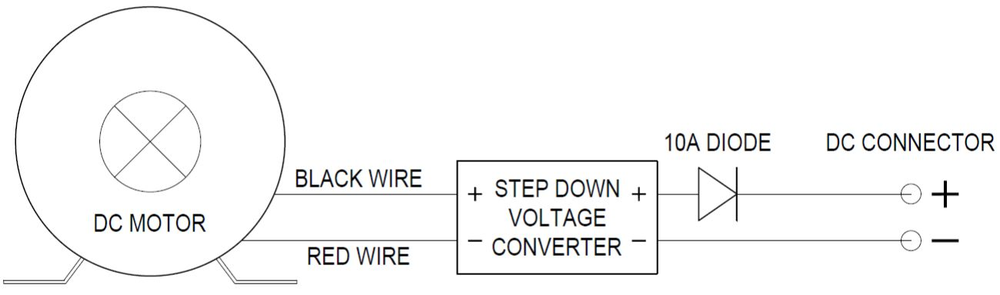
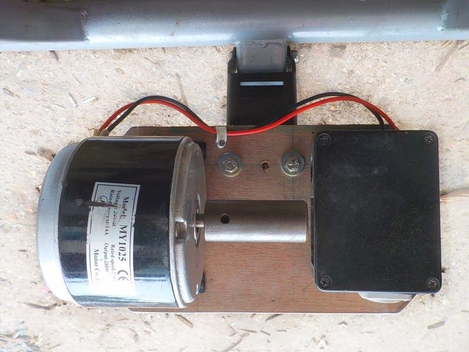
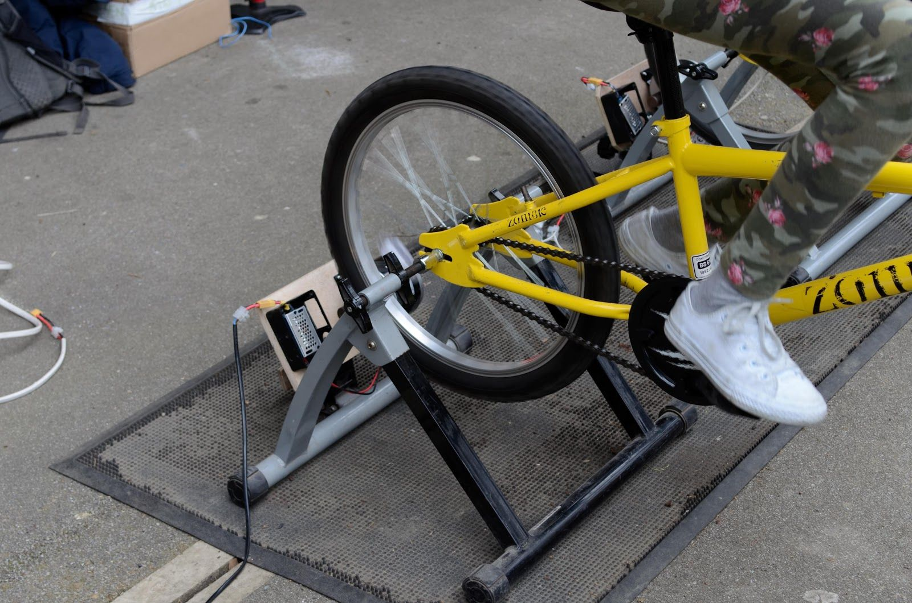

Assembling the bike generator
=============================

The bike generators used by DEE are based on using a step-down converter to regulate the output voltage from the generator. They can be linked together in parallel to charge a capacitor or battery when used to power higher loads.

The first thing to do is attach the roller to the motor. Our metal rollers slide onto the shaft of the motor and are then fixed in place by tightening a grub screw with a small allen key. 

Mount the motor and voltage controller on a stiff plywood board or metal plate. The motor has a foot plate with 6mm threaded holes that bolts can be screwed directly into. To protect the voltage regulator, it can be mounted inside a plastic project box or similar enclosure. 

|mounting_board|

The wires from the motor should connect to the input on the voltage regulator. Remember that to generate electricity, the motor will be spun in reverse, so the positive and negative wires should be reversed - the black wire should connect to the positive input and the red wire should connect to the negative input. You will also need to connect a 10A diode to the output to prevent backflow from a capacitor or battery. To make it easy to connect the generator to other devices, it is worth using a standard connector on the output, such as an XT60 or Powercon.

|dc_motor|

The motor/regulator board should be attached the metal mounting plate on the training stand with 6mm bolts. Use large washers to spread the load on a wooden mounting board, and split ring washers to maintain the bolt tightness.

|dc_motor_mounted|

With a bicycle mounted on the training stand, check the position of the back wheel. It should be located as close to the motor body as possible. You can adjust the axle clamps on the training stand to move the wheel sideways as needed. Once the wheel is in the appropriate position, the mounting plate needs to be tensioned so that it can turn the roller. Turn the tensioning screw under the mounting plate until the roller is pressed firmly against the tyre on the back wheel of your bike. The tighter it is, the less chance of the tyre slipping when turning the roller under high loads, but the more friction will be generated. The exact tightness to use can be found through trial and error - test the generator on the highest load you expect to use, and if there is any slippage, increase the tension slightly and test again until it turns without slipping at all.

You should now be ready to use the bike generator. You can use it to directly power a variety of 12V appliances - lights, stereo, kettle, phone charging, laptop charging, etc. Bear in mind that the most power you should expect to generate from one bike generator is around 100 Watts.

|generator_for_use|

