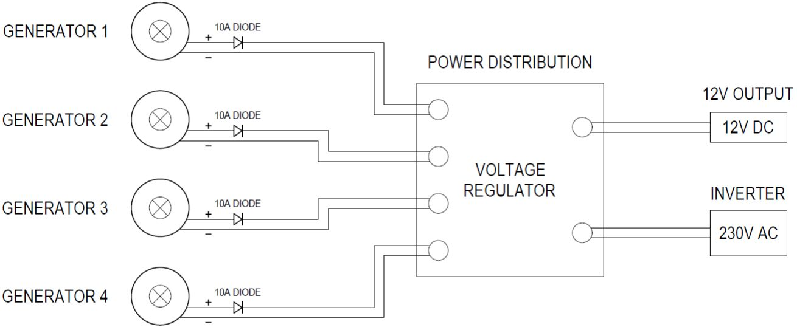

Using multiple bike generators
==============================

For loads of more than 100W, you will need to build a system that uses more than one bike generator. If multiple bike generators are being used at the same time, their power can be combined via a distribution board, which can contain all the voltage regulation and system protection components. 

|multiple_generator_diagram|

Cables and connectors
^^^^^^^^^^^^^^^^^^^^^

We use 20A Powercon connectors when connecting the bikes into either a multiple or single bike system. The connectors hold a good connection, can be easily connected and disconnected, and are simple to make yourself. You can also use XT60 connectors as a cheaper option, but they are not as robust or easy to use.

It’s a good idea to get fairly thick, heavy duty wire for your power cables, especially when dealing with long cables (2m or more). Long runs of thin wire will result in significant energy losses - the smaller the wire diameter, the more it heats up when an electrical current is passed through it, and the more energy is lost. Paired (black \& red wires in the same sheath) 4mm 2 (or 2.5mm 2 ) core speaker cable is a good option, which results in a good looking, durable cable.

|connectors|

Inverters
^^^^^^^^^

If you want to use AC mains powered appliances you will need to use an inverter, which will convert the 12V DC power from your bike generator(s) into 240V AC power. There are two types of inverters: a pure sine wave inverter produces a smooth wave on the AC output, while a modified (or quasi) sine wave produces a stepped square wave. Some devices may not work properly with a modified sine wave inverter.

Inverters designed to work with 12V batteries will usually work with voltages between 10 and 14 volts, but will work best with a power supply with a voltage of 12-13 volts. If using an inverter, it is highly recommended that you use a large capacitor or battery to maintain a smooth, stable voltage on the power supply to the inverter.

|inverter|

An example of a multi-generator system distribution board
---------------------------------------------------------

The image to the right shows a distribution board for a bike generator system built by `Electric Pedals <https://www.electricpedals.com/>`_.

It has five blue powercon inputs linked together with bus bars to connect up to five bike generators in parallel. 

It uses a Maxwell supercapacitor to smooth the power output and provide some energy storage.

It has a Morningstar charge controller with a large resistor acting as a dump load to regulate the voltage and protect the system against over-voltage. The inverter displays the system voltage to provide feedback to the users.

The output goes via a Victron inverter connected to regular household 3-pin sockets to provide 230V AC power. 

Fuses from the power input and to the inverter protect the system against over-current.

A system like this can be used with unregulated generators, so the power would come directly from the motors without needing to go through a voltage converter. 

More information on the components used in this system (inverters, fuses, charge controllers, etc) can be found in our `Intro to DIY Off Grid Systems <https://www.demandenergyequality.org/get-started-with-offgrid>`_ guide.

|example_board|

|example_diagram|

.. |example_board| image:: ../../Images/image_5_4_(example_board).png

